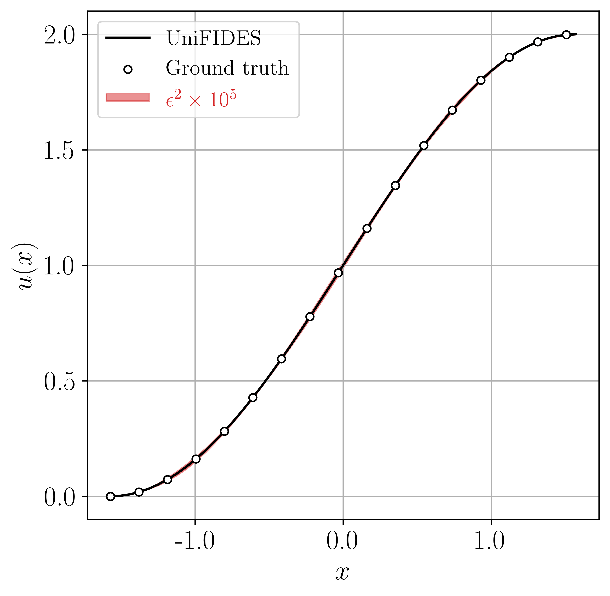
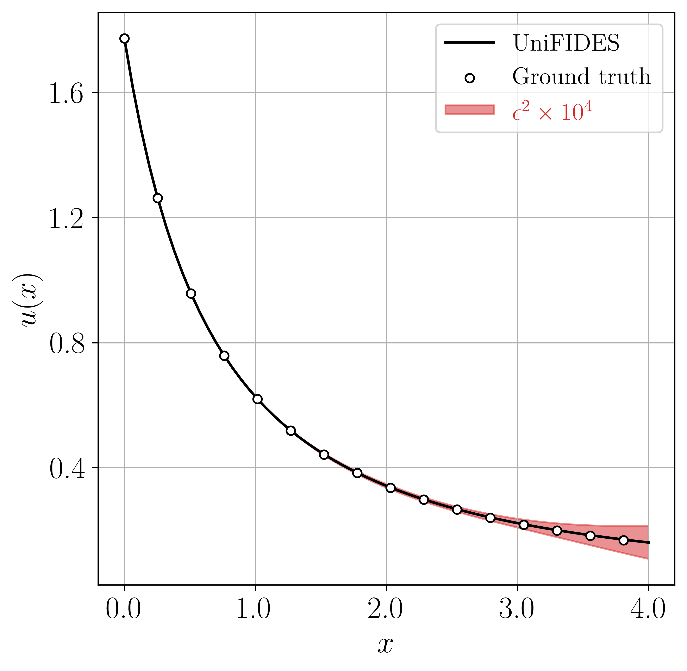

# Universal Integer-Order and Fractional Integro-Differential Equation Solvers
This project is currently submitted to [Nature Machine Intelligence](https://www.nature.com/natmachintell/). The work is titled "*UniFIDES: Universal Fractional Integro-Differential Equation Solvers.*"

This is a TensorFlow implementation of a robust, user-friendly platform to solve integer-order and fractional FIDEs in forward and inverse directions.

## What to expect
In the provided notebook, two examples of Fredholm and Volterra equations are solved in the form of a forward problem.

Open UniFIDES in Google Colab:
  [](https://colab.research.google.com/github/procf/RhINNs/blob/main/UniFIDES/UniFIDES.ipynb)

## Software/package requirements
In this project, the following packages are actively used:
1. `python` v3.11.7, 
2. `tensorflow` v2.15.0 (for the backbone),
3. `numpy` v1.26.2 (you know), and
4. `pandas` v2.1.3 (for pre-/post-processing).

## Hardware/OS tested
The program was tested on an MBP M1 Max (64 GB RAM) without GPU acceleration running macOS Sonoma v14.2.1 


## Background

Solving forward and inverse problems in the form of differential equations, which govern the spatio-temporal evolution of numerous dynamical systems across scientific and engineering disciplines, has been the core of extensive research endeavors for decades. Science-aware machine learning tools, nonetheless, have proven transformative over the past few years in relaxing many traditional constraints required to solve such systems numerically, such as numerical discretization, mesh generation, stability conditions, and more.

Although machine learning platforms have achieved notable success in solving differential equations, there is still a significant gap in developing universal machine learning solutions for integro-differential equations. This gap widens further when considering FIDEs, in which the integral and derivative operators may accept any real numbers. FIDEs are particularly challenging to solve yet are fundamental in modeling critical phenomena such as the stock market, pandemic spread, and population growth of species.

Here, we introduce a physics-aware platform named UniFIDES, designed to solve FIDEs for both forward and inverse problems. Agnostic to nonlinearity and the type of problem in nature, UniFIDES is tested on a variety of Fredholm and Volterra integer-order and fractional cases across a broad range of scientific applications and remained competitive in terms of accuracy and computation cost. With its out-of-the-box functionality, UniFIDES may be readily streamlined with current computational pipelines to augment machine intelligence.

The provided notebook solves two instances of Fredholm and Volterra equations by toggling the `Type` switch in the code. Let's begin with the former, which is an integer-order nonlinear 1D Fredholm IDE with applications in diffusion processes and quantum mechanics:

```math
\begin{equation}
\left\{
\begin{aligned}
&\left[ {}^{1} \mathcal{D}_x \right] u(x) = \cos{x} - x + \frac{1}{4}\left[ {}^1 \mathcal{I}_{-1/4}^{1/4} \right] xt u^2(t) \, \mathrm{d}t \\
&x \in \left[ -\frac{\pi}{2}, \frac{\pi}{2} \right]\\
&u\left( -\frac{\pi}{2} \right)=0
\end{aligned}
\right.
\end{equation}
```

Here, $`\left[ {}^{1} \mathcal{D}_x \right]`$ is the derivative operator of order $`\beta=1`$, and $`\left[ {}^1 \mathcal{I}_{-1/4}^{1/4} \right]`$ is the integral operator of order $\alpha=1$ between $`-1/4`$ and $`1/4`$. In fact, $`\alpha`$ and $`\beta`$ can be any real numbers. The exact solution reads $`u(x) = 1 + \sin{x}`$. This is a forward problem, and the objective is to find $`u(x)`$. This problem is implemented in its continuous form in the notebook, and UniFIDES' prediction is plotted below.



Case 5 in this submission is a 1D Volterra fractional integral equation (FIE):

```math
\begin{equation}
\left\{
\begin{aligned}
&u(x) = \sqrt{\pi}\left(1+x\right)^{-1.5} - 0.02\frac{x^3}{1+x} + 0.01x^{2.5}\left[ {}^{0.5} \mathcal{I}_{0}^{x} \right] u(t) \mathrm{d} t\\
&x \in \left[ 0, 4 \right]\\
&u\left(0\right)=\sqrt{\pi}
\end{aligned}
\right.
\end{equation}
```

The integral operator in this case has a fractional order ($`\alpha = 0.5`$), and the exact solution reads $`u(x) = \sqrt{\pi}(1 + x)^{-1.5}`$. Such FIEs are frequently seen in crystal growth and heat conduction. By setting `Type='Volterra'`, this FIE is solved by UniFIDES, whose prediction is plotted below:




Here's the submission abstract: 

The development of data-driven approaches for solving differential equations has been followed by a plethora of applications in science and engineering across a multitude of disciplines and remains a central focus of active scientific inquiry. However, a large body of natural phenomena incorporates memory effects that are best described via fractional integro-differential equations (FIDEs), in which the integral or differential operators accept non-integer orders. Addressing the challenges posed by nonlinear FIDEs is a recognized difficulty, necessitating the application of generic methods with immediate practical relevance. This work introduces the Universal Fractional Integro-Differential Equation Solvers (UniFIDES), a comprehensive machine learning platform designed to expeditiously solve a variety of FIDEs in both forward and inverse directions, without the need for ad hoc manipulation of the equations. The effectiveness of UniFIDES is demonstrated through a collection of integer-order and fractional problems in science and engineering. Our results highlight UniFIDES' ability to accurately solve a wide spectrum of integro-differential equations and offer the prospect of using machine learning platforms universally for discovering and describing dynamical and complex systems.

## Contributors
This work was done by [Milad Saadat](https://scholar.google.com/citations?user=PPLvVmEAAAAJ&hl=en&authuser=1) and [Safa Jamali](https://scholar.google.com/citations?user=D1asaYIAAAAJ&hl=en). Authors are thankful for insightful discussions with Dr. Deepak Mangal, and
also acknowledge the support from the National Science Foundation’s DMREF
program through Award \#2118962.

